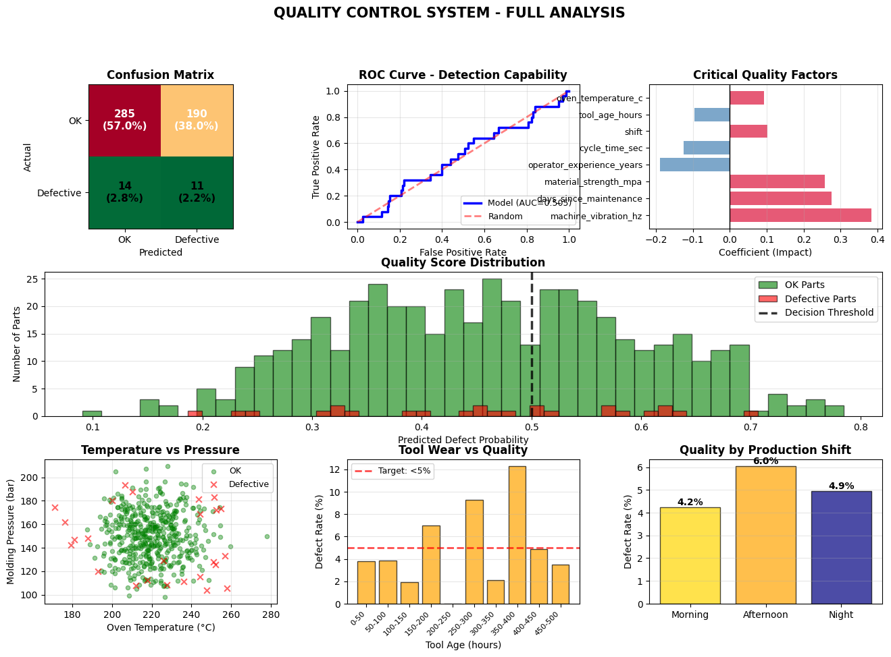

# 🏭 Predictive Quality Control in Manufacturing
## A Logistic Regression Proof-of-Concept

[](https://www.python.org/downloads/)
[](https://scikit-learn.org/)
[](https://opensource.org/licenses/MIT)

**Companion repository for LinkedIn article:** *From €50K/Month Losses to Real-Time Quality Control*

---

## 🎯 Project Overview

This proof-of-concept demonstrates how **logistic regression** can enable real-time predictive quality control in manufacturing environments. While simple compared to deep learning approaches, logistic regression offers critical advantages:

- ✅ **Interpretable:** Engineers understand why each decision is made
- ✅ **Fast:** <1ms predictions suitable for high-speed production lines
- ✅ **Transparent:** Coefficients reveal root causes of quality issues
- ✅ **Production-ready:** Easy to deploy and maintain

### ⚠️ Important Disclaimer

**This is a proof-of-concept using synthetic data.** All sensor readings, production parameters, and defect outcomes are artificially generated to model realistic manufacturing scenarios. The methodology is sound and production-ready; the specific numbers demonstrate potential value but are not from actual production systems.

---

## 📊 Dataset Specifications

### Synthetic Data Generation

We created a realistic dataset simulating an **electronics component manufacturing line**:

```python
Total samples: 2,000 production parts
Training set: 1,500 samples (75%)
Test set: 500 samples (25%)
Defect rate: 5% (100 defective parts in full dataset)
```

### Features (12 parameters)

**Machine Parameters:**
- `oven_temperature_c`: Oven temperature (°C) - Normal(220, 15)
- `molding_pressure_bar`: Molding pressure (bar) - Normal(150, 20)
- `line_speed_mpm`: Line speed (meters/min) - Normal(45, 5)
- `ambient_humidity_pct`: Ambient humidity (%) - Normal(45, 10)

**Material Parameters:**
- `material_thickness_mm`: Material thickness (mm) - Normal(2.5, 0.3)
- `material_strength_mpa`: Material strength (MPa) - Normal(350, 40)

**Operational Parameters:**
- `cycle_time_sec`: Cycle time (seconds) - Normal(12, 2)
- `machine_vibration_hz`: Machine vibration (Hz) - Uniform(0.5, 3.5)
- `tool_age_hours`: Tool age (hours) - Uniform(0, 500)

**Context:**
- `shift`: Shift (1=Morning, 2=Afternoon, 3=Night)
- `operator_experience_years`: Operator experience (years) - Uniform(1, 20)
- `days_since_maintenance`: Days since last maintenance - Uniform(1, 30)

### Defect Generation Logic

Defects are generated based on a **weighted risk score** to simulate realistic manufacturing behavior:

```python
defect_score = (
    0.15 × |temperature_deviation_from_220°C| +
    0.10 × |pressure_deviation_from_150bar| +
    0.12 × vibration_level +
    0.08 × (tool_age / 100) +
    0.05 × days_since_maintenance +
    -0.03 × operator_experience +
    random_noise
)

# Top 5% of risk scores → labeled as defective
```

This creates a **realistic 5% defect rate** with clear causal relationships that the model can learn.

---

## 🔬 Model Performance

- **Model:** Logistic Regression

- **ROC-AUC:** ~0.63 (illustrative with synthetic data)

### Threshold Flexibility
The REST API supports a custom threshold for classification (default = 0.5):

```
{"defect_probability": 0.06, "predicted_defect": 0, "threshold_used": 0.5}
{"defect_probability": 0.06, "predicted_defect": 0, "threshold_used": 0.3}

```
- Lower threshold → higher recall, more false positives

- Higher threshold → fewer false positives, lower recall


---

## 💰 Business Impact (Illustrative)


- Production volume: 500,000 parts/year
- Defect rate: 5%
- Cost per defect reaching customer: €500
- Cost per false positive inspection: €5

**Net annual savings:** ~€1.6M (synthetic scenario)


## 🚀 Quick Start

### Installation

```bash
# Clone repository
git clone https://github.com/AntonioLeites/predictive-quality-control.git
cd predictive-quality-control

# Create virtual environment
python -m venv venv
source venv/bin/activate  # On Windows: venv\Scripts\activate

# Install dependencies
pip install -r requirements.txt
```
You have **two alternatives** to explore this PoC:

- Run the Jupyter Notebook (Full Analysis)
- Step-by-Step Execution
- 

### Run the Analysis

```bash
# Open Jupyter Notebook
jupyter notebook

# Open: notebooks/predictive_quality_control.ipynb
# Run all cells (Ctrl+Enter)
```
### Expected Output

The notebook will:
1. Generate synthetic dataset (2,000 samples)
2. Train logistic regression model
3. Display performance metrics
4. Show 7 visualizations:
   - Confusion matrix
   - ROC curve
   - Feature importance
   - Temperature vs defects
   - Tool age analysis
   - Quality by shift
   - Real-time sensor trends

Full analysis report is saved as:
docs/Quality_Control_System_FullAnalysis.png



### Step-by-Step Execution
1.  Generate synthetic data
```bash
   python src/data_generation.py
```

2. Train the logistic regression model
```bash
   python src/model_training.py
```
3. Run the REST API
```bash
   uvicorn src.prediction_api:app --reload
```
4. Make predictions via API
   ```bash
   curl -X POST "http://127.0.0.1:8000/predict?threshold=0.5" -H "Content-Type: application/json" -d '{\
   "oven_temperature_c": 240, \
   "molding_pressure_bar": 160, \
   "line_speed_mpm": 46, \
   "ambient_humidity_pct": 40,  \
   "material_thickness_mm": 2.5,  \
   "material_strength_mpa": 355,  \
   "cycle_time_sec": 12,  \
   "machine_vibration_hz": 1.5,  \
   "tool_age_hours": 420,  \
   "shift": 2,  \
   "operator_experience_years": 3,  \
   "days_since_maintenance": 15  \
   }'


## 🏗️ Enterprise Architecture: SAP Integration

This POC becomes production-ready when integrated with SAP systems:
This POC becomes production-ready when integrated with SAP systems:
```
┌─────────────────────────────────────────────────────────────┐
│                    SAP S/4HANA Manufacturing                │
│  ┌────────────────┐  ┌─────────────┐  ┌─────────────────┐   │
│  │ Production     │  │   Quality   │  │   Equipment     │   │
│  │ Orders (PP)    │  │   Mgmt (QM) │  │   Master Data   │   │
│  └────────────────┘  └─────────────┘  └─────────────────┘   │
└───────────────────────────┬─────────────────────────────────┘
                            │ OData APIs / CDS Views
                            ↓
┌─────────────────────────────────────────────────────────────┐
│               SAP Plant Connectivity (PCo)                  │
│  ┌──────────────────────────────────────────────────────┐   │
│  │  Real-time Sensor Data (OPC-UA / MQTT)               │   │
│  │  • Temperature  • Pressure  • Vibration  • Tool Age  │   │
│  └──────────────────────────────────────────────────────┘   │
└───────────────────────────┬─────────────────────────────────┘
                            │
                            ↓
┌─────────────────────────────────────────────────────────────┐
│                    SAP BTP AI Core                          │
│  ┌──────────────────────────────────────────────────────┐   │
│  │  Logistic Regression Model (REST API)                │   │
│  │  Input: Sensor readings → Output: Defect probability │   │
│  └──────────────────────────────────────────────────────┘   │
└───────────────────────────┬─────────────────────────────────┘
                            │
                            ↓
┌─────────────────────────────────────────────────────────────┐
│                   SAP Joule Studio                          │
│  ┌──────────────┐  ┌──────────────┐  ┌──────────────────┐   │
│  │ Skill 1:     │  │ Skill 2:     │  │ Skill 3:         │   │
│  │ Get Sensors  │→ │ Predict Risk │→ │ Root Cause       │   │
│  └──────────────┘  └──────────────┘  │ Analysis         │   │
│                                       └──────────────────┘  │
└───────────────────────────┬─────────────────────────────────┘
                            │
                            ↓
┌─────────────────────────────────────────────────────────────┐
│                   SAP Joule (User Interface)                │
│                                                             │
│  User: "Why is Line 2 showing high defect risk?"            │
│                                                             │
│  Joule: "Line 2 has 68% defect risk because:                │
│         • Oven temp at 245°C (target: 220°C)                │
│         • Tool age 420h (recommend change at 400h)          │
│         Recommended: Replace tool + recalibrate oven"       │
└─────────────────────────────────────────────────────────────┘
```


### Implementation Steps

1. **Deploy ML Model to BTP AI Core** (Week 1)
   - Package model as Docker container
   - Deploy to AI Core with auto-scaling
   - Expose REST endpoint

2. **Create Joule Skills** (Week 2)
   - `getSensorData(lineId)` → Plant Connectivity
   - `predictDefectRisk(sensors)` → AI Core
   - `getProductionContext(lineId)` → S/4HANA PP/QM
   - `analyzeRootCause(lineId)` → Orchestrates above

3. **Configure Plant Connectivity** (Week 2-3)
   - Install PCo agents on production line
   - Map SCADA tags to SAP structure
   - Enable real-time streaming

4. **Enable Automated Actions** (Week 3)
   - Risk > 70% → Create QM notification
   - Risk > 85% → Trigger maintenance workflow
   - Daily summary → Email to quality manager

---

## 📁 Repository Structure

```
predictive-quality-control/
│
├── notebooks/
│   └── predictive_quality_control.ipynb    # Main analysis
│
├── src/
│   ├── data_generation.py                  # Synthetic data creation
│   ├── model_training.py                   # Model training pipeline
│   ├── prediction_api.py                   # REST API for deployment
│   └── utils.py                            # Helper functions
│
├── data/
│   ├── synthetic_production_data.csv       # Generated dataset
│   └── data_dictionary.json                # Feature descriptions
│
├── models/
│   └── logistic_regression_v1.pkl          # Trained model
│
├── deployment/
│   ├── Dockerfile                          # Container for BTP
│   ├── requirements.txt                    # Python dependencies
│   └── joule_skills/                       # Joule Studio skill definitions
│       ├── get_sensor_data.yaml
│       ├── predict_defect_risk.yaml
│       └── analyze_root_cause.yaml
│
├── docs/
│   ├── technical_specifications.md         # Detailed specs
│   ├── cost_benefit_analysis.xlsx          # ROI calculations
│   └── sap_integration_guide.md            # Step-by-step SAP setup
│
├── tests/
│   ├── test_model.py                       # Unit tests
│   └── test_api.py                         # API tests
│
├── README.md                               # This file
├── LICENSE                                 # MIT License
└── .gitignore
```

---

## 🛠️ Technical Stack

- **Python 3.8+**
- **scikit-learn 1.3+** (LogisticRegression, StandardScaler, GridSearchCV)
- **pandas 2.0+** (Data manipulation)
- **numpy 1.24+** (Numerical operations)
- **matplotlib 3.7+** (Visualizations)
- **Chart.js 4.4** (Dashboard visualizations)

**Deployment:**
- **SAP BTP AI Core** (Model hosting)
- **Flask/FastAPI** (REST API)
- **Docker** (Containerization)

---

## 🤝 Contributing

This is a proof-of-concept for educational purposes. If you'd like to:
- Extend to multi-class classification (defect types)
- Add time-series forecasting for preventive maintenance
- Implement with real production data
- Integrate with other MES/SCADA systems

Please open an issue or submit a pull request!

---

## 📄 License

MIT License - see [LICENSE](LICENSE) file for details.

---

## 📬 Contact & Discussion

**LinkedIn Article:** [Link to your LinkedIn post]

**Author:** Antonio Leites  
**LinkedIn:** [Your LinkedIn profile]  
**Email:** antonio.leites@mac.com

---

## 🙏 Acknowledgments

- Dataset generation inspired by real manufacturing best practices
- Cost assumptions based on industry benchmarks from [cite sources if you have them]
- SAP integration architecture follows SAP BTP reference patterns

---

## ⭐ If this helped you...

Please give this repository a star ⭐ and share your experience implementing predictive quality control in your manufacturing environment!

**Questions?** Open an issue or reach out on LinkedIn.

---

**Last Updated:** January 2025  
**Version:** 1.0.0